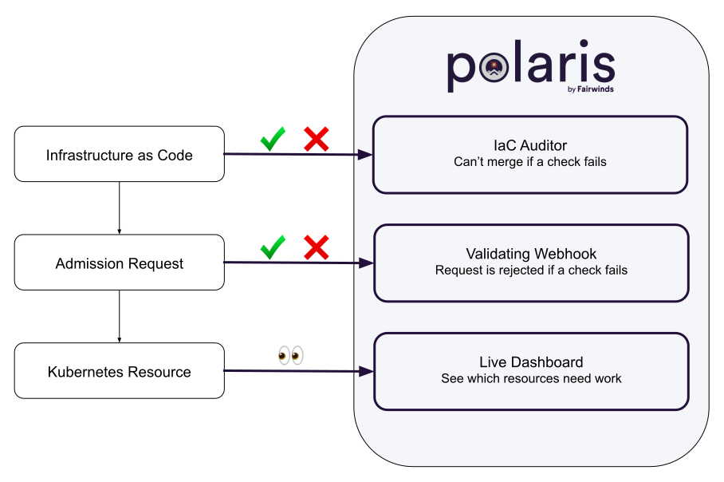

# Deployment methods

Polaris can be run in three different modes:
* As a `dashboard` - Validate Kubernetes resources against policy-as-code.
* As an `admission controller` - Automatically reject or modify workloads that don't adhere to your organization's policies.
* As a `command-line tool` - Incorporate policy-as-code into the CI/CD process to test local YAML files.

  

